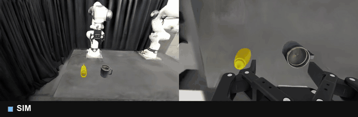
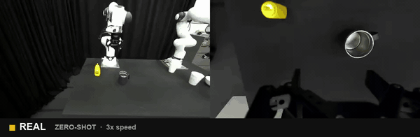
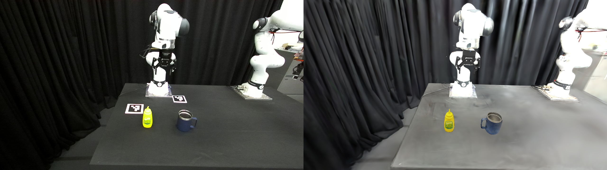
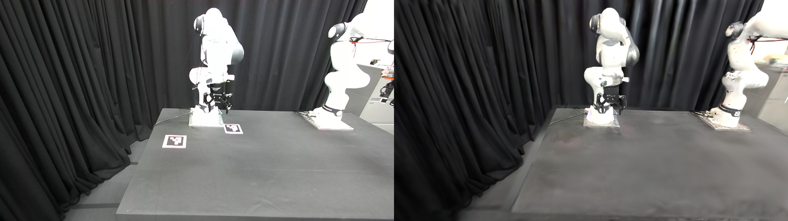

# single-video-real2sim2real

One human demonstration video of a pour, a Gaussian-splat reconstruction of the robot's own
table, and no teleoperation: this repository generates a synthetic DROID-format dataset of a
Franka arm pouring a mustard bottle into a cup, fine-tunes π0.5 on it, evaluates the policy
in the same simulator on held-out placements, and runs it zero-shot on a real Franka FR3. It
is a research integration on top of two published systems, PolaRiS (the splat-rendered
IsaacLab evaluation stack and its DROID policy conventions) and Real2Render2Real (the
single-video trajectory-synthesis method), with the scene asset converted from a GSWorld
reconstruction. The importable package is `r2s2r` (real-to-sim-to-real).

## Demo

<p align="center">
<br>
<em><b>Simulation.</b> The fine-tuned &pi;<sub>0.5</sub> policy on a held-out placement in the Gaussian-splat reconstruction (external camera left, wrist camera right). Video: <a href="results/videos/demo_sim.mp4">results/videos/demo_sim.mp4</a> (38 s).</em>
</p>

<p align="center">
<br>
<em><b>Real robot, zero-shot.</b> The same checkpoint on the Franka FR3 with no real-world fine-tuning, 3&times; speed. Video: <a href="results/videos/demo_real.mp4">results/videos/demo_real.mp4</a> (35 s) &middot; <a href="https://drive.google.com/file/d/1L6XNSg5zBRMjBuRxUfQErBS44NhcPLfO/view?usp=drive_link">combined cut on Google Drive</a>.</em>
</p>

<p align="center">
 <br>
<em>Left: a frame of the human demonstration beside the reconstructed scene with the objects placed where the tracker saw them. Right: a real recording of the arm beside the simulator posed at the same recorded joint angles.</em>
</p>

## Pipeline

Each stage maps to a script; Isaac-side stages run through `scripts/polaris_env.sh`.

1. **Scene and object assets** (`scripts/real2sim/build_scene_assets.sh`). GSWorld's finished
   3DGS reconstruction of the cell is rigidly transformed (with spherical-harmonics rotation)
   into the robot's kinematic base frame, the robot is split out into 19 per-link splats by
   GSWorld's per-gaussian labels, the tabletop is cleaned, relit and given a collision slab,
   and the result is composed into a PolaRiS environment (`DROID-PourMustard`). The camera
   pose is solved from real depth against the forward-kinematic arm. Recipe and acceptance
   numbers: `docs/gsworld_to_polaris.md`.
2. **Demonstration to object trajectory.** The bottle's and cup's 6-DoF track through the
   demonstration video is an input to this repository (a FoundationPose track, `DEMO_TRACK`),
   not produced by it; Real2Render2Real's own 4D tracker needs a multi-view object scan that
   was not made. See "Scope".
3. **Trajectory synthesis** (`scripts/datagen/synthesize_trajectories.py`). Real2Render2Real's
   grasp-and-follow state machine, jaxmp batched IK and trajgen resampling, taken out of their
   simulator class and run offline. Initial layouts are perturbations of the demonstration's
   (`make_initial_conditions.py`, 50 conditions). Every episode is gated on joint limits (the
   FR3-and-Panda intersection), libfranka's position-dependent velocity envelope capped by the
   deployment soft wall, a measured acceleration ceiling, IK error and gripper-to-cup
   clearance; an episode that only exceeds the motion budget is re-synthesised slower rather
   than dropped. Gate maths: `r2s2r.limits`; numbers: `docs/fr3_limits.md`.
4. **Physics replay and gating** (`scripts/datagen/replay_reference_episode.py`). Each
   reference trajectory is replayed open loop in the PolaRiS environment as 8-d DROID actions
   (seven absolute joint positions plus a binary gripper); the bottle moves only if it is
   actually gripped. A pour rubric written in PolaRiS's checker style
   (`r2s2r/environments/rubrics.py`) scores the task; the physics gate
   (`r2s2r.physics_gate`) keeps the episodes that grasped, carried and did not knock
   the cup. Both camera views are rendered in the same pass at 180×320.
5. **Dataset** (`scripts/datagen/build_rlds.py`, `check_units.py`, `analyse_dataset.py`).
   DROID-RLDS in the schema of PolaRiS's official co-training dataset
   (`docs/data_format.md`), verified end to end through openpi's loader, and measured for
   coverage.
6. **Fine-tuning** (`r2s2r/training/pour_mustard_config.py`). openpi's
   `pi05_droid_jointpos_polaris` configuration with the dataset swapped, LoRA enabled, batch
   32, 10k steps, official normalisation statistics. The config is registered into openpi;
   training itself is openpi's `scripts/train.py`.
7. **Simulation evaluation** (`scripts/eval/`). PolaRiS's `eval.py` and `DroidJointPos`
   client unchanged, on 30 held-out placements with a 70 s horizon, sharded across GPUs, with
   outcome-by-layout analysis.
8. **Real robot** (`scripts/real_robot/run_eval_safe.py`). DROID's evaluation client run
   under the joint-position conventions the checkpoint was trained for, with the client
   patched in memory and an abort-only motion watchdog. `docs/real_robot.md`.

## Scope and contributions

Written for this repository:

- the integration of the two systems into one offline-then-physics data pipeline, and the
  hand-off format between them;
- the GSWorld → PolaRiS scene conversion and cleanup recipe (`scripts/real2sim/`), the
  kinematic-frame anchoring of camera and scene from real depth, and the real-vs-sim
  acceptance tooling;
- the trajectory synthesiser's assembly and its gates: FR3-and-Panda limits, the libfranka
  velocity envelope, the measured acceleration ceiling, grasp pre-screening against the
  envelope's zero-speed bands, time rescaling instead of rejection, cup clearance;
- the pour rubric and the physics gate, and the physics replay script that produces the data;
- the DROID-RLDS writer and the unit check through openpi's loader;
- sharded evaluation, outcome-by-layout analysis, commanded-speed logging, real-speed
  rendering and the report page;
- the real-robot launcher (in-memory client patches, gripper-timing compensation, watchdog)
  and the placement check.

Upstream, used as published:

| Component | Source | Licence | Used for |
|---|---|---|---|
| PolaRiS | github.com/arhanjain/polaris, commit 129abc4; renderer branch zubair-irshad/polaris `gsplat-3dgs-renderer`, baseline 1e3a6d4 | MIT | environment, robot model and action conventions, splat compositing, rubric framework, evaluation loop, policy client, PolaRiS-Hub robot assets, training configuration |
| Real2Render2Real | github.com/uynitsuj/real2render2real, commit 0ac79eb, with jaxmp (d1ab9c7), jaxls (21219e08), trajgen (6b19f56), rsrd (cca2256) | MIT | state machine and timing constants, grasp candidate construction, batched IK, trajectory retargeting and resampling, kinematic checks |
| openpi | github.com/Physical-Intelligence/openpi, submodule bd70b8f (config verified identical to 15a9616) | Apache-2.0 | π0.5 model, DROID-RLDS loader, training, policy server, `pi05_droid_jointpos_polaris` base checkpoint and norm stats |
| GSWorld | github.com/luccachiang/GSWorld (Jiang et al.), 96594c1 | no licence file | the scene06 splat, per-gaussian link labels, object meshes, camera calibration and the eight real recordings used for acceptance. Reference only: none of it is redistributed here, and the scene cannot be rebuilt without a GSWorld checkout |

Two further inherited inputs are not upstream software: the demonstration's object track
(a FoundationPose output from the lab's earlier pipeline, recorded as "to be replaced") and
the lab robot's execution-layer velocity limits (transcribed, to be re-read on the robot).
`docs/provenance.md` lists, file by file, what each script corresponds to upstream and every
deviation.

## Results

All numbers are reproduced in `docs/results.md` with the file each one comes from.

**Checkpoint sweep**, 30 held-out placements (same sampler and range as the training
layouts, different seed), 70 s per episode, open-loop horizon 8, identical settings per
checkpoint (`results/phase5_eval/sweep/*.csv`):

| checkpoint | success | rate | mean progress |
|---|---|---|---|
| base π0.5 (no fine-tuning) | 0/3 | 0% | 0.667 |
| 1000 steps | 2/5 | 40% | 0.800 |
| 2000 steps | 17/30 | 57% | 0.833 |
| 5000 steps | 29/30 | 97% | 0.989 |
| 7000 steps | 24/30 | 80% | 0.922 |
| 8000 steps | 28/30 | 93% | 0.978 |
| 10k steps (saved as 9999) | 30/30 | 100% | 1.000 |

Progress is the fraction of the rubric's criteria reached (reach, lift, pour), so 0.667 is
"grasped but did not pour": the base policy already grasps; fine-tuning adds the pour. The
base and 1000-step rows were run on few conditions to validate the chain and show the trend
only. The 7000-step dip sits between 97%, 93% and 100%, so it is evaluation noise on a
plateau, not a regression.

**Dataset.** 50 initial conditions; 216 reference trajectories passed the kinematic gate
over two synthesis batches; 182 passed the physics gate and were written to RLDS: 81,469
frames, 64 shards, 4.2 GB. The 182 cover 43 of the 50 conditions (median 4 episodes per
condition) with 22 distinct grasps; episodes are 348 steps at the median, 665 at the 90th
percentile, 969 at most (15 Hz). The bottle starts inside a 10×9 cm box and the cup inside
6×6 cm, which is the footprint the policy is valid for.

**Training.** LoRA fine-tune of `pi05_droid_jointpos_polaris`, batch 32, 10k steps, learning
rate 5e-5 cosine with 1000 warm-up steps (openpi's official values), on four RTX 6000 Ada at
1.9 s/it: about 5.3 hours. 10k × 32 samples is 3.9 passes over the 81,469 frames.

**Real robot** (2026-08-14, first session, `results/real_robot_20260814/`): 13 episodes on
the FR3 with the 10k checkpoint, zero-shot, nothing added at evaluation time; 4 completed
the pick, carry and pour (ep09, ep11, ep12, ep13). 4/13 is not a success rate: nine failures
came before the placement issue was identified (the bottle was placed too far from the
gripper for the training distribution), and once the placement was moved in, three
consecutive episodes succeeded. A fixed-placement run of ten or more episodes has not been
done. [Demo video (Google Drive)](https://drive.google.com/file/d/1L6XNSg5zBRMjBuRxUfQErBS44NhcPLfO/view?usp=drive_link).

**Scene fidelity** against eight real recordings (arm posed at the recorded joint angles):
exterior PSNR about 17 at the chosen exposure, whole-frame IoU 0.89-0.90, arm silhouette IoU
0.81-0.84; replaying measured teleoperation joint angles as absolute-position actions gives
0.9-1.8 degrees rms tracking error, one control period of lag (`results/replay_validation/`).

## Setup

See `docs/setup.md` for the full record (machine, venvs, pinned versions, the two required
deviations from PolaRiS's `pyproject.toml`, and the things that mislead). In short, the heavy
stacks are external checkouts located through environment variables:

| variable | points at |
|---|---|
| `POLARIS_ROOT` | PolaRiS checkout with its `.venv` and `PolaRiS-Hub/` |
| `POLARIS_3DGS` | the `gsplat-3dgs-renderer` branch checkout |
| `WORK` | working directory for generated artifacts |
| `GSWORLD_ROOT` | GSWorld checkout (scene source; not redistributed) |
| `TWODGS`, `TRAJ_VENV`, `RLDS_VENV` | the 2DGS checkout and the two offline venvs |
| `DEMO_TRACK` | the demonstration's tracked object trajectory (not included) |

The pure-Python part of this repository (the `r2s2r` package's `limits`, `physics_gate`,
`pour_geometry`, `alignment`, `robot_links` modules, the tests and the example) needs only
numpy and scipy:

```bash
pip install -e .[dev]
python -m pytest tests -q
```

## Quick start

The smallest runnable step needs no GPU, simulator or external checkout: it applies the
kinematic gate and the pour criterion to a bundled synthetic episode and the physics gate to
the three real replay reports in `results/`.

```bash
python examples/gate_and_rubric_demo.py
```

`examples/README.md` shows the expected output. The first GPU step, with the PolaRiS stack and
a built environment, is the environment smoke test:

```bash
POLARIS_ROOT=... POLARIS_3DGS=... scripts/polaris_env.sh \
  python scripts/real2sim/check_environment.py --condition 0 --steps 60
```

## Repository layout

```
src/r2s2r/
  limits.py                FR3-and-Panda limits, velocity envelope, motion budget, home ramp (numpy)
  physics_gate.py          which replayed episodes become data (numpy)
  pour_geometry.py         the pour criterion's geometry (numpy)
  alignment.py             Umeyama similarity fit
  robot_links.py           per-link mesh sampling for the robot splat split
  environments/            PourMustardCfg / PourMustardEnv registration, pour rubric (Isaac)
  training/                openpi training config for the fine-tune
scripts/
  polaris_env.sh           runs anything against the environment with the gsplat backend
  real2sim/                scene asset build, solvers, real-vs-sim acceptance
  datagen/                 grasps, synthesis, preview, physics replay, RLDS, unit check, coverage
  eval/                    sharded simulation evaluation and analysis
  real_robot/              FR3 launcher, placement check, observation comparison, archiving
docs/                      design, provenance, FR3 limits, data format, scene conversion,
                           asset layout, setup, real robot, results
results/                   small summaries, CSV/JSON logs and a few frames (videos: see results/README.md)
tests/                     pytest suite for the dependency-free modules and tools
examples/                  the CPU-only walk-through
```

## Limitations and known issues

- One task, one object pair, one scene. Nothing here is a general real-to-sim-to-real
  system; it is a complete instance of one.
- Narrow placement footprint: 10×9 cm for the bottle, 6×6 cm for the cup, the cup always on
  the bottle's +y side. This follows the Real2Render2Real / lab recipe for the layout draw;
  widening it requires retargeting the pour, not changing a bound.
- Real-robot evidence is a first session: 4 successes in 13 episodes, with the failures
  explained by placement after the fact and no fixed-placement success rate measured.
- The demonstration's object trajectory comes from an external tracker and is an input;
  Real2Render2Real's own tracking was not used (no multi-view object scan).
- The gripper-timing patches in the real-robot launcher compensate for a dynamics gap
  (binary, instantaneous gripper in sim; 1.7 s stroke on the robot) that should be fixed on
  the data side.
- The deployment velocity wall used by the gate is a transcription and was not re-read on the
  robot before the test.
- The GSWorld-derived scene asset, object meshes, calibration and recordings are not
  included and cannot be, so the scene cannot be rebuilt from this repository alone; the
  demonstration recording, the generated dataset, the checkpoint and the videos are also not
  in the repository (see `results/README.md`).
- Evaluation success is the rubric's: tilt over the cup's mouth, above the rim, held for one
  second. Liquid is not simulated.

## Acknowledgments and citations

This work builds directly on:

- **PolaRiS** — Jain et al., *PolaRiS: Policy Learning and Real-to-Sim Evaluation with
  Gaussian Splatting*, github.com/arhanjain/polaris (MIT), and the `gsplat-3dgs-renderer`
  branch by Zubair Irshad.
- **Real2Render2Real** — Yu et al., *Real2Render2Real: Scaling Robot Data Without Dynamics
  Simulation or Robot Hardware*, github.com/uynitsuj/real2render2real (MIT), with jaxmp,
  jaxls, trajgen and RSRD.
- **openpi / π0.5** — Physical Intelligence, github.com/Physical-Intelligence/openpi
  (Apache-2.0).
- **GSWorld** — Jiang et al., ICRA 2026, github.com/luccachiang/GSWorld (no licence file;
  reference only).

Also used: franka_description and libfranka (Franka Robotics), IsaacLab 2.3.0 and Isaac Sim
(NVIDIA), gsplat, SplatSim's spherical-harmonics rotation, hbb1/2d-gaussian-splatting, the
DROID platform and its RLDS builder template. Please cite the upstream papers when using this
code; `CITATION.cff` is for this repository itself.

## Assets and upstream licences

The code and documentation written for this repository are released under the MIT licence
(`LICENSE`). That licence does not cover, and this repository does not contain, the
Gaussian-splat scene asset, object meshes, camera calibrations or recordings derived from
GSWorld (github.com/luccachiang/GSWorld), which carries no licence file; without a GSWorld
checkout the scene cannot be rebuilt. PolaRiS, Real2Render2Real and openpi are not
redistributed here either and stay under their own licences (MIT, MIT and Apache-2.0) in
their own repositories.
